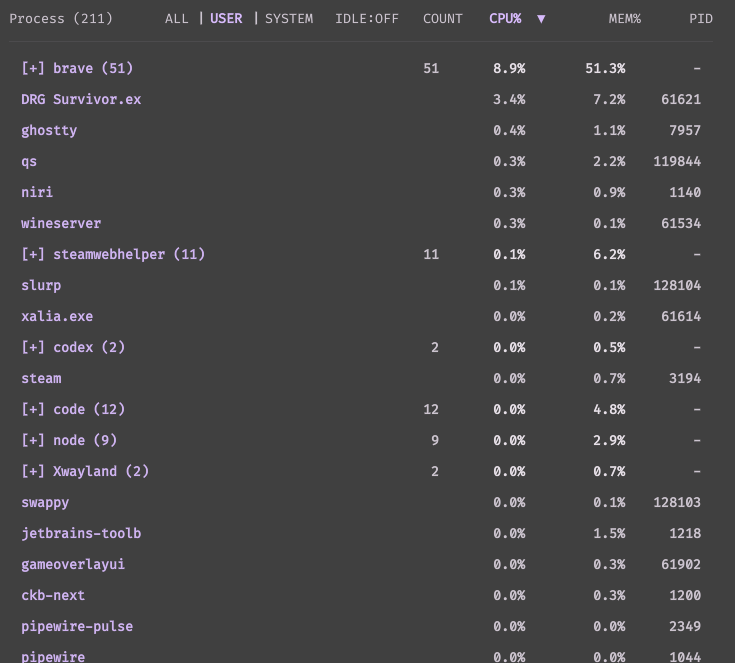

# Process List (DMS Desktop Plugin)

[](https://github.com/Mithgroth/dms-process-list/releases/latest)
[](https://plugins.danklinux.com/processlist.html)

Desktop widget for DankMaterialShell that shows running processes with live CPU and memory telemetry.

Use it as a lightweight process monitor on the desktop for spotting heavy apps, grouped process trees, and user vs system activity at a glance.



## Features

- Live process list from `DgopService` (backed by `dgop`)
- CPU and memory values from DMS process telemetry
- Sorting by process name, count, CPU, memory, and PID
- Grouping by process command (singletons stay as normal rows)
- Expand/collapse grouped processes
- Scope filter: `ALL | USER | SYSTEM`
- Toggle to hide idle processes
- Process name color coding:
  - User processes: accent color
  - System processes: gray
  - Mixed groups: default text color
- USER/SYSTEM split uses owner metadata when available from `DgopService`
- If owner metadata is unavailable, scope automatically falls back to `ALL`

## Requirements

- DankMaterialShell with desktop plugin support (`>=0.1.18`)
- `dgop`

## Installation

### Via DMS

```bash
dms plugins install processList
```

### Via DMS GUI

1. Open DMS Settings with `Mod + ,`
2. Open the `Plugins` tab
3. Click `Browse`
4. Search for `Process List`
5. Install and enable the plugin
6. Add `Process List` from `Desktop Widgets`

### Option 1: Git clone

```bash
cd ~/.config/DankMaterialShell/plugins
git clone https://github.com/Mithgroth/dms-process-list.git processList
dms restart
```

### Option 2: Release tarball

```bash
mkdir -p ~/.config/DankMaterialShell/plugins
tar -xzf processList-1.0.1.tar.gz -C ~/.config/DankMaterialShell/plugins
dms restart
```

Then enable `Process List` in `Settings -> Plugins`, and add it from `Desktop Widgets`.

## Usage

- Click column headers to sort.
- Click `ALL`, `USER`, or `SYSTEM` to switch scope.
- Click `IDLE:ON/OFF` to toggle idle filtering.
- Click grouped rows (`[+]` / `[-]`) to expand or collapse.

## Discoverability

This plugin may also be useful if you are searching for:

- DMS process monitor
- DankMaterialShell process widget
- Linux process list desktop widget
- desktop CPU and memory process monitor
- grouped process monitor for DMS
- dgop desktop widget

## Links

- GitHub repo: https://github.com/Mithgroth/dms-process-list
- Latest release: https://github.com/Mithgroth/dms-process-list/releases/latest
- DMS plugin registry entry: https://plugins.danklinux.com/processlist.html

## Packaging

Create a release archive from this directory:

```bash
./package.sh
```

This writes `dist/processList-<version>.tar.gz`.
